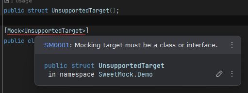

# SM0001 : Unsupported target (Error)

The specified target is not support as a mocking target. 

This will occure in the following situations
- targeting other types than interfaces or classes.
- targeting a record type.
- targeting a static class.
- targeting a sealed class.
- targeting a private class.
- targeting a class with no accessible constructors.

To fix change the type or access level of the target.
