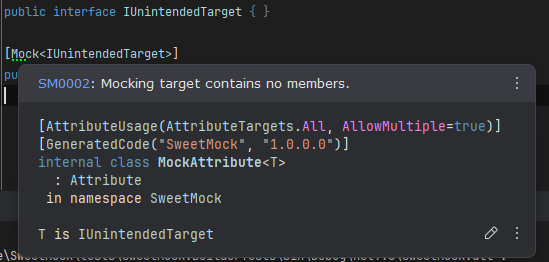

# SM0002: Unintended Target (Warning)

The specified target is not suitable for mocking.

This warning occurs when attempting to mock an empty interface or a class without any overridable members.



**Resolution:**  
Add members to the target type or suppress this warning using:

```csharp
#pragma warning disable SM0002
```
