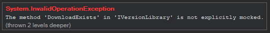
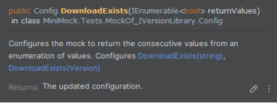

# Getting started

## Installation and First Use

Reference the NuGet package in your test project:

```sh
dotnet add package SweetMock
```

- Specify which interface to mock by using the `[Mock<IMyRepository>]` attribute before your test or test class:
- Create a new instance of the mock using the `Mock.IMyRepository()` factory method.
- Configure the mock using the `config` parameter of the factory method.
- Specify how the relevant members should behave using the member name and specify the behavior using the parameters. 
- Use the mock in your test as you see fit.

As code:

```csharp
[Fact]
[Mock<IMyRepository>] // Specify which interface to mock
public void MyTest() {
    var mockRepo = Mock.IMyRepository(// Create a new instance of the mock using the mock factory
        config => config // Configure the mock using the config parameter
            .CreateCustomerAsync(return: Guid.NewGuid()) // Specify how the relevant members should behave
        );
    var sut = new CustomerMaintenance(mockRepo); // Use the mock in your test as you see fit
    
    sut.Create(customerDTO, cancellationToken);
}
```

## Quality of Life

SweetMock is **extremely strict** but **fair**, requiring you to specify all features you want to mock but giving you fair warnings if you don't.
This is by design to make sure you are aware of what you are mocking and not introduce unexpected behaviour.



All mockable members are available through a **fluent interface** with **IntelliSense**, **type safety**, and **documentation**.



## Please note

- Any member (method, property, indexer) not explicitly configured will throw an `InvalidOperationException` with a clear message.
- This is by design to ensure strictness and avoid unintentional test behavior.
